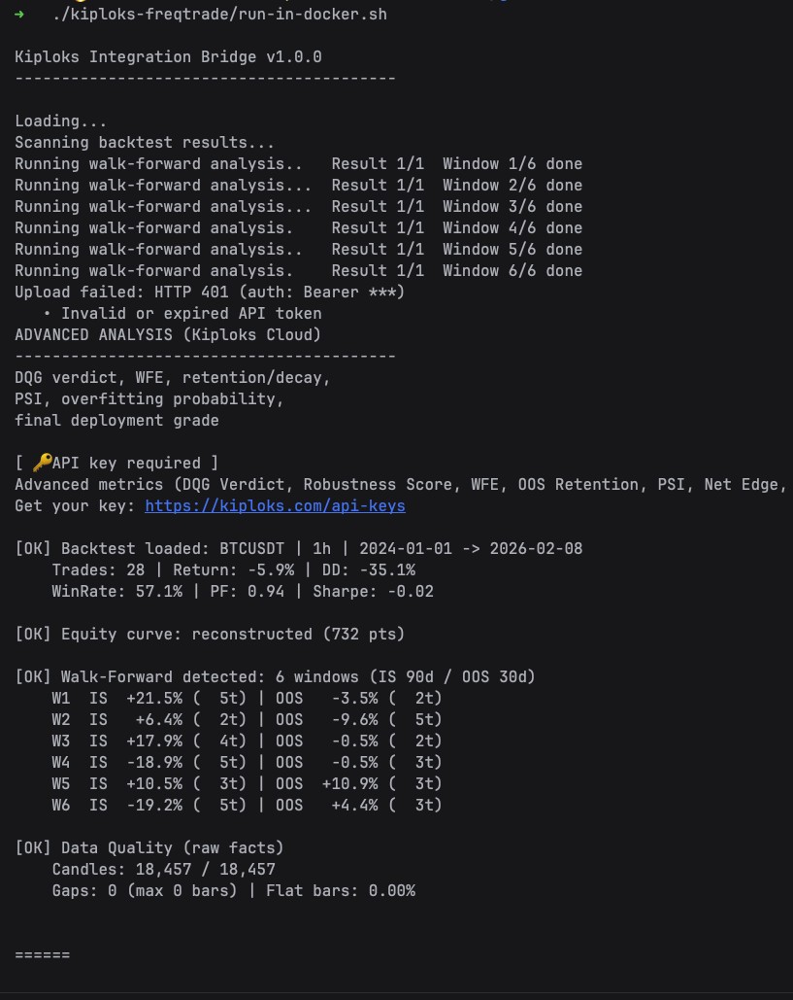

# Kiploks Integration for Freqtrade

**Bridge the gap between backtesting and live trading.**

This integration allows you to seamlessly send your [Freqtrade](https://www.freqtrade.io) Backtest and Walk-Forward Analysis (WFA) results to the Kiploks platform for advanced robustness stress-testing.

* **Zero friction:** No patches, no plugins, and no local Python dependencies required.
* **Deep insights:** Automated Parameter Robustness, Governance analysis, and Benchmark comparisons (vs BTC).
* **Docker-native:** Runs entirely within your existing Freqtrade container.

---

## Key Features

* **Automated WFA:** Generates Walk-Forward Analysis automatically if not present in your results.
* **Parameter Robustness:** Automatically links Hyperopt trials to your backtests.
* **Clean Workflow:** Just run your backtests as usual, then execute the script to sync.
* **Instant Analysis:** Get direct `kiploks.com/analyze/...` links right in your terminal.



---

## Quick Start

### 1. Installation

Clone the repository directly into your Freqtrade project root:

```bash
# Navigate to your freqtrade project folder (containing docker-compose.yml)
git clone https://github.com/kiploks/kiploks-freqtrade.git
git rm -rf kiploks-freqtrade/.git
chmod +x kiploks-freqtrade/run-in-docker.sh

```

### 2. Configuration

Create your config from the template and add your API credentials:

```bash
cp kiploks-freqtrade/kiploks.json.example kiploks-freqtrade/kiploks.json

```

Edit `kiploks-freqtrade/kiploks.json` and fill in:

* `api_token`: Your key from **Kiploks -> API Keys**.

### 3. Usage

Run the script from your **project root**:

| OS | Command |
| --- | --- |
| **Linux / macOS** | `./kiploks-freqtrade/run-in-docker.sh` |
| **Windows (CMD)** | `kiploks-freqtrade\run-in-docker.bat` |

---

## Configuration Details (`kiploks.json`)

| Option | Default | Description |
| --- | --- | --- |
| `api_url` | `"https://kiploks.com"` | Kiploks API base URL. Required for upload. |
| `api_token` | `""` | Your API key from Kiploks -> API Keys. Required for upload. |
| `top_n` | `3` | Number of most recent backtest files to process. |
| `skip_already_uploaded` | `true` | Prevents duplicate uploads using `uploaded.json` tracker. |
| `wfaPeriods` | (optional) | Number of WFA windows. If not set, derived from date range and window size. |
| `wfaISSize` | `90` | In-sample window size in days for WFA. |
| `wfaOOSSize` | `30` | Out-of-sample window size in days for WFA. |
| `epochs` | `10` | Hyperopt epochs when auto-running hyperopt (min 3). |
| `hyperopt_loss` | `"SharpeHyperOptLoss"` | Hyperopt loss function (e.g. `SharpeHyperOptLoss`). |
| `hyperopt_result_path` | `""` | Path to `.fthypt` file. If empty, the latest file in `user_data/` is used. |
| `keep_last_n_backtest_files` | (not set) | Keep last N script-created backtest files (WFA). If unset or 0, they are removed after run. |

---

## Project Structure

Your project should look like this for the script to detect paths correctly:

```text
ft_userdata/
├── docker-compose.yml
├── user_data/
│   ├── backtest_results/
│   ├── hyperopt_results/
│   └── ...
└── kiploks-freqtrade/       <-- cloned repo
    ├── run.py
    ├── kiploks.json
    └── ...
```

---

## Troubleshooting & API Errors

### API errors (POST /api/integration/results)

| Code | Cause | What to do |
|------|--------|------------|
| **401** | Missing `Authorization` header (Bearer API key required). | Set `api_token` in `kiploks.json`. |
| **401** | Invalid or expired API token. | Generate a new key in Kiploks -> API Keys and update `api_token`. |
| **403** | `results must be a non-empty array`. | Fix payload: send a non-empty results array. |
| **403** | Maximum number of stored tests reached. | Delete some tests on the **Data** page in Kiploks, then retry. |
| **400** | Result at index N is missing required data for analysis. | Ensure payload has valid backtestResult, symbol, walkForwardAnalysis.periods, parameters.strategy; run script again after fixing backtest/config. |
| **400** | Benchmark is required; payload must have date range and timeframe. | Set backtestResult.config.startDate, endDate and timeframe. |
| **400** | Cannot compute benchmark: market data for this timeframe and date range is not available. | Try a different period or timeframe. |
| **429** | Only one analyze request per minute is allowed. | Wait (script retries once after `retryAfterSeconds`); if still 429, try again later. |
| **502** | Failed to submit results (proxy to backend failed). | Retry later; check Kiploks status. |

### Script / environment errors

* **not found user_data folder** – Run the script from the directory that contains `user_data/` (project root with `docker-compose.yml`). Use `run-in-docker.sh` or `run-in-docker.bat` from that root.
* **Config not found or empty** – Copy `kiploks.json.example` to `kiploks.json` in the same folder as `run.py` and set `api_url` and `api_token`.
* **user_data/backtest_results not found** – Run Freqtrade backtesting first so that `user_data/backtest_results/` exists and contains result files.
* **FREQTRADE_CMD rejected** / **FREQTRADE_CMD is not set** – When not running inside Docker, set the `FREQTRADE_CMD` environment variable to your freqtrade invocation (e.g. `docker compose run --rm freqtrade`). Prefer running via `run-in-docker.sh` so the script runs inside the Freqtrade environment.
* **Run this script from the Freqtrade environment** – Use Docker: `run-in-docker.sh` (Linux/macOS) or `run-in-docker.bat` (Windows) from the project root.

---

*Developed as part of the Kiploks ecosystem. For detailed documentation, visit [kiploks.com/freqtrade-integration](https://kiploks.com/freqtrade-integration).*

---
